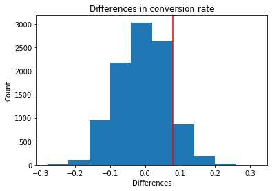
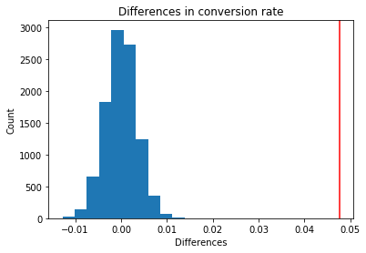

# How statistical inference is relevant to data science?
Say we want to make a change to our website design to improve conversion rate for all our users. So we ran a test on some of our users, where half of them saw the old page and half of them saw the new page. After we collected data on a number of users, we found that the new page indeed led to higher conversion rate! But wait, we only tested on a relatively small set of our users. Would the result still be the same for other users? We are not sure. There is still a lot of uncertainty.

Here statistical inference comes to our rescue and would allow us to draw some conclusions based on that data. The method is called hypothesis testing or AB test.

## Hypothesis testing
How to do hypothesis testing?

Say we tested 1000 users (sample) where 500 of them saw the old page (control group) and 500 of them saw the new page (treatment group).
Compute the conversion rate for each group and compute the difference. We want to understand whether this difference is statistically significant or not.

To do so, first compute the conversion rate of all users in our sample, say 0.9. Then simulate a number (say 10000) of samples of size 1000, with 0.9 chance of converting and 0.1 chance of not converting. This can be achieved using numpy.random.choice(). Then we will get 10000 samples with varying conversion rates between two groups due to natural variations. And we can compute the conversion rate difference between two groups for all 10000 samples. This is to simulate how much our results vary if we did the study again

Plot the distribution of these 10000 differences. This is called sampling distribution. We will see a normal distribution.

Now we need to compare our current difference with all these 10000 differences. Below shows two examples.

The above example shows that there are about 10% of simulated values that are equal or larger than our current result. This implies that the probability to obtain our current result or even larger differences due to natural variation is about 10%. This is pretty high, given that the common threshold is 1% or 5%. So the current conversion rate change in our sample is not statistically significant.

The above example shows that no simulated values are equal or larger than our current result. So it is unlikely to obtain our current result due to natural variation or chance. So the current difference in conversion rate is statistically significant.

## Limitations of the approach
- Change aversion or novelty effect for existing users may introduce bias
